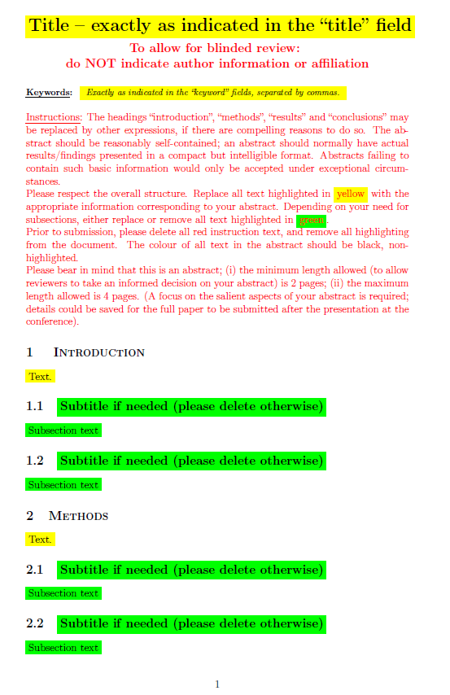

templates
=========

Templates for NTTS abstracts, papers and presentation
---

This is a _"working repo"_ with templates / layouts for:
* paper submission in both [`LaTeX`](https://www.latex-project.org/) and `Word` formats, and
* paper presentation, including visuals
at the [NTTSS conferences series](https://ec.europa.eu/eurostat/cros/content/ntts-conferences_en) 

### 2021

All material is stored in the [NTTS21/](NTTS21) repo.
**Official templates, *i.e.* final versions to be used for submission, can be found on the conference website**, *e.g.* [2021 NTTS templates](https://ec.europa.eu/eurostat/cros/content/NTTS2021_en#section-3)  for instance.

<table align="center"> 
        <!-- <header> <td align="centre">Template front page</td></header> -->
        <tr> <td align="center" width=350px"> </img></td></tr> 
</table>

### 2023

Not yet there...
